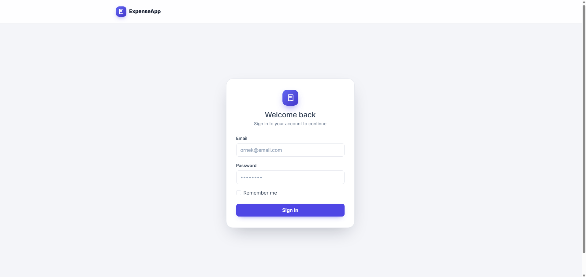
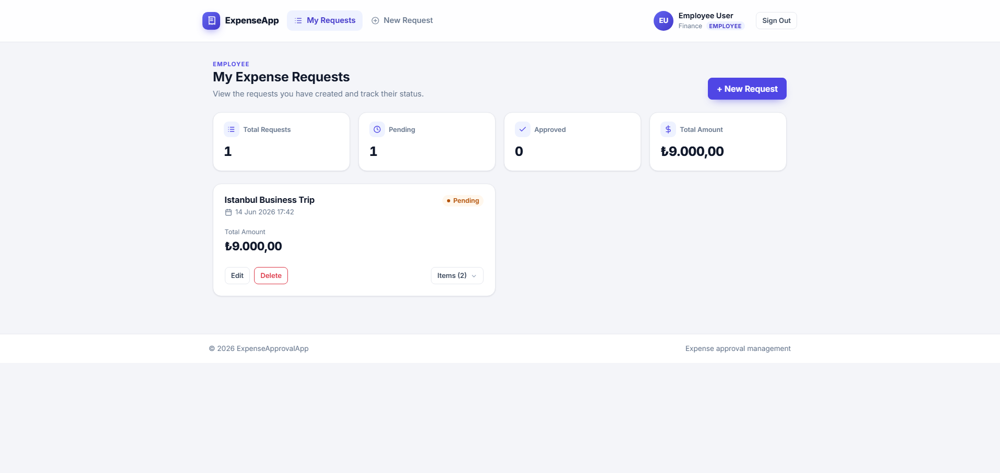
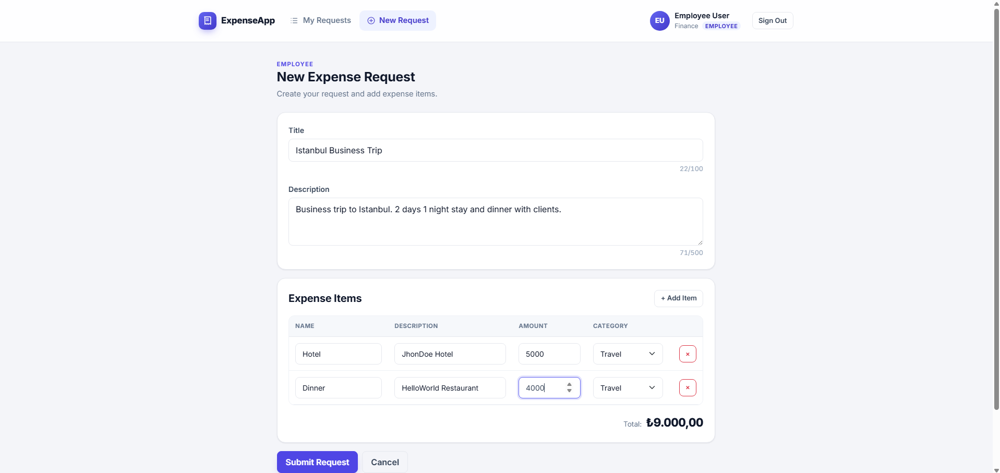
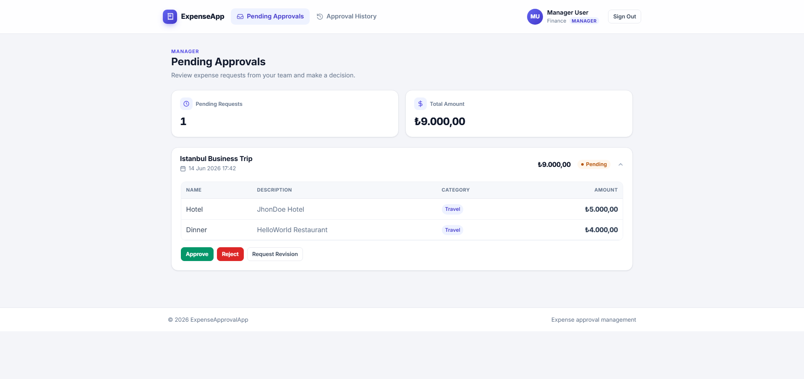
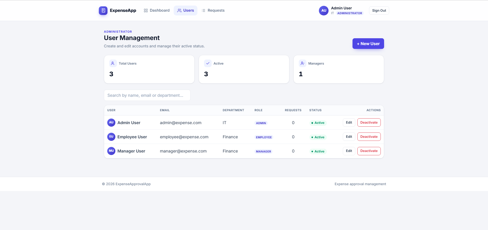
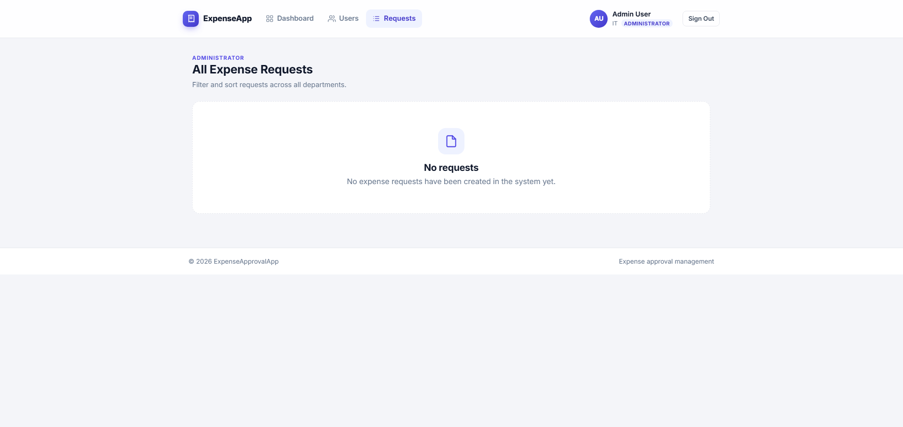

# 💸 Expense Approval App

A clean, role-based **expense request and approval** web application built with ASP.NET Core MVC. Employees submit itemized expense requests, managers review and decide on them, and administrators manage users and oversee every request across the organization.

<p>
  
  
  
  
  
</p>

---

## ✨ Overview

The application models a typical corporate expense workflow with three roles. Each request is automatically routed to the right approver, kept in sync through a clear set of statuses, and protected by role-based authorization and ownership checks.

| Role | What they can do |
| --- | --- |
| 👤 **Employee** | Create itemized expense requests, track their status, edit or delete pending/revision requests |
| 🧑‍💼 **Manager** | Review requests from their department, approve, reject, or request a revision with a note |
| 🛡️ **Administrator** | Create and manage user accounts, reset passwords, activate/deactivate users, and view & filter all requests |

---

## 📸 Screenshots

<table>
  <tr>
    <td width="50%"><br/><sub><b>Sign in</b></sub></td>
    <td width="50%"><br/><sub><b>Employee — My Requests</b></sub></td>
  </tr>
  <tr>
    <td width="50%"><br/><sub><b>Create a request</b></sub></td>
    <td width="50%"><br/><sub><b>Manager — Pending Approvals</b></sub></td>
  </tr>
  <tr>
    <td width="50%"><br/><sub><b>Admin — User Management</b></sub></td>
    <td width="50%"><br/><sub><b>Admin — All Requests</b></sub></td>
  </tr>
</table>

---

## 🚀 Features

### For Employees
- Create expense requests with multiple line items (name, description, amount, category)
- Live running total while building a request
- Track each request through its lifecycle with clear status badges
- Edit or delete requests that are still **Pending** or have a **Revision Requested**
- Read manager feedback directly on rejected or revision-requested cards

### For Managers
- See only the requests routed to them (same department), filtered to those awaiting a decision
- **Approve**, **Reject** (with a reason), or **Request Revision** (with notes)
- Browse a full decision history of everything they've acted on

### For Administrators
- Create **Employee** and **Manager** accounts
- Edit user details, change roles, and reset passwords
- Activate or deactivate accounts (deactivated users cannot sign in)
- View **all** requests across departments with live **status / department filtering** and **sorting** (by date or amount)
- At-a-glance summary stats (totals, pending, approved, total amount)

---

## 🔄 Request Lifecycle

```
Employee creates request ──▶ Pending
                                │
              ┌─────────────────┼─────────────────┐
              ▼                 ▼                 ▼
          Approved          Rejected      Revision Requested
                                                  │
                                 Employee edits & resubmits ──▶ Pending
```

When a request is created, it is automatically assigned to a **Manager in the same department** as the employee. A request can only be edited or deleted by its owner while it is **Pending** or **Revision Requested**.

**Statuses:** `Pending` · `Approved` · `Rejected` · `Revision Requested`
**Categories:** `Travel` · `Supply` · `Client` · `Other`

---

## 🛠️ Tech Stack

- **Framework:** ASP.NET Core MVC (.NET 10)
- **Language:** C#
- **Data:** Entity Framework Core 10 + SQL Server (code-first migrations)
- **Auth:** ASP.NET Core Identity (cookie auth, role-based authorization)
- **UI:** Razor Views, Bootstrap 5, a custom design system (Inter typography), jQuery validation

---

## 📦 Getting Started

### Prerequisites
- [.NET 10 SDK](https://dotnet.microsoft.com/download)
- SQL Server (LocalDB, Express, or a full instance)
- (Optional) the EF Core CLI: `dotnet tool install --global dotnet-ef`

### 1. Clone the repository
```bash
git clone <repository-url>
cd ExpenseApprovalApp
```

### 2. Configure the database connection
Copy the example settings file and set your connection string:

```bash
cp ExpenseApprovalApp/appsettings.example.json ExpenseApprovalApp/appsettings.json
```

Then edit `appsettings.json`:

```json
{
  "ConnectionStrings": {
    "DefaultConnection": "Server=.;Database=ExpenseApprovalDb;Trusted_Connection=True;TrustServerCertificate=True;"
  }
}
```

### 3. Apply migrations
```bash
dotnet ef database update --project ExpenseApprovalApp
```

### 4. Run the app
```bash
dotnet run --project ExpenseApprovalApp
```

The site is served at:
- **HTTP:** http://localhost:5194
- **HTTPS:** https://localhost:7083

On first launch the database is seeded with the default roles and accounts below.

---

## 🔑 Default Accounts

| Role | Email | Password |
| --- | --- | --- |
| Administrator | `admin@expense.com` | `Admin123!` |
| Manager | `manager@expense.com` | `Manager123!` |
| Employee | `employee@expense.com` | `Employee123!` |

> The Manager and Employee seed accounts share the **Finance** department, so requests created by the Employee are routed to the Manager out of the box. Change these credentials before deploying anywhere real.

---

## 🔒 Security

- **Role-based authorization** — each controller is restricted to its intended role (`Employee`, `Manager`, `Admin`).
- **Ownership checks (IDOR protection)** — edit, delete, and approval actions verify that the current user actually owns or is responsible for the request before making any change.
- **Anti-forgery tokens** on all state-changing forms.
- **Account deactivation** — deactivated users are blocked at sign-in.

---

## 🗂️ Project Structure

```
ExpenseApprovalApp/
├── Controllers/          # Account, Expense, Approval, Admin, Home
├── Data/                 # AppDbContext, SeedData
├── Models/
│   ├── Entities/         # AppUser, ExpenseRequest, ExpenseItem
│   ├── Enums/            # ExpenseStatus, ExpenseCategory
│   └── ViewModels/       # Request, user, and login view models
├── Views/                # Razor views + shared layout and badge partials
├── Migrations/           # EF Core migrations
└── wwwroot/              # Static assets (css/site.css design system, js, libs)
```

---

## 📄 License

This project is provided as-is for educational and demonstration purposes.
